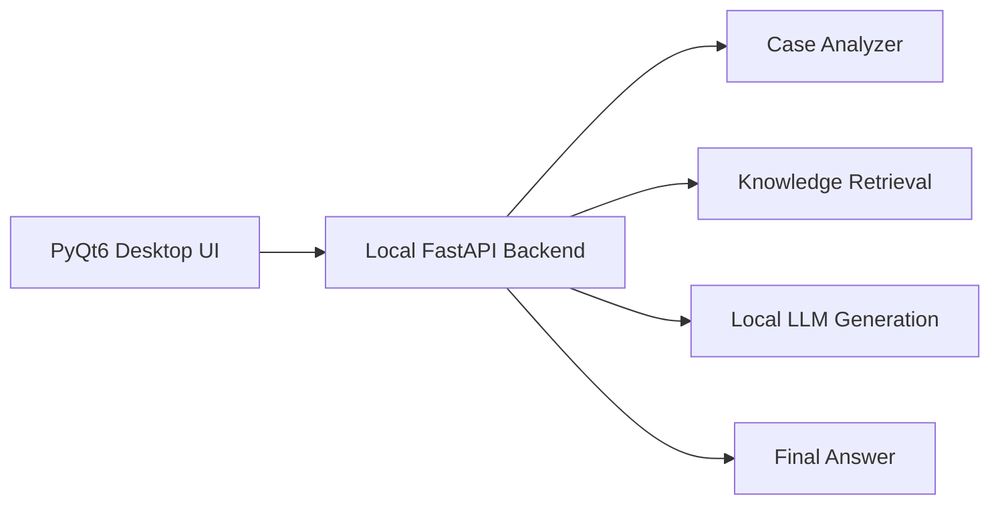

# Roadmap

Local Support AI is evolving as an offline-first desktop AI assistant with a local backend, local model inference, private knowledge retrieval, and measurable answer quality.

The roadmap focuses on backend architecture, data modeling, RAG-style retrieval, evaluation, and portfolio-ready engineering practices.

## 1. FastAPI Core

Make FastAPI the main orchestration layer for the app.

Target flow:

Planned work:

- Keep the desktop UI focused on interaction and presentation.
- Move business flow orchestration into FastAPI.
- Use a central endpoint for the main answer-preparation scenario.
- Keep smaller endpoints for diagnostics, testing, and future integrations.
- Preserve local-only behavior through `localhost` and `127.0.0.1`.

## 2. Database Layer

Move toward a clearer persistence layer with explicit data models.

Planned entities:

- `Conversation`
- `Feedback`
- `KnowledgeArticle`
- `KnowledgeCase`
- `EvaluationRun`

Planned work:

- Introduce SQLAlchemy models.
- Add indexes for common analytics queries.
- Prepare the project for migrations.
- Keep local SQLite as the default storage.

## 3. Knowledge Base

Develop the local knowledge base into a structured source of product facts and answer examples.

Planned sections:

- Knowledge articles: rules, facts, and explanations.
- Knowledge cases: example requests, expected topics, expected facts, and strong answer samples.

Planned work:

- Add validation for article and case files.
- Add import support for safe `.json` or `.md` knowledge files.
- Keep private knowledge outside the public repository.
- Show which facts were used during answer generation.

## 4. RAG v2

Improve retrieval quality before adding a vector database.

Planned work:

- Improve keyword and intent-based ranking.
- Rank facts by relevance to the current request.
- Track matched terms and retrieved articles.
- Add confidence signals for retrieval quality.
- Later evaluate embeddings or a local vector store if needed.

## 5. Evaluation Lab

Make quality measurable with synthetic test cases.

Planned metrics:

- Topic accuracy.
- Fact retrieval quality.
- Answer quality.
- Average SLA.
- Peak SLA.
- Feedback accuracy.

Planned work:

- Add a test-case format for expected topic and facts.
- Add a batch evaluation runner.
- Store evaluation runs locally.
- Show results in the app analytics section.
- Export evaluation summaries for portfolio documentation.

## 6. History and Review

Turn generated answers into a feedback loop.

Planned work:

- Add a conversation history view.
- Reopen a previous request and answer.
- Mark answers as useful or needing correction.
- Save corrected answers as style examples.
- Use feedback to improve future prompts and quality rules.

## 7. Portfolio Packaging

Make the project easy to understand from GitHub.

Planned work:

- Add a clean architecture diagram.
- Add safe synthetic screenshots.
- Add setup and run instructions.
- Add a short explanation of offline-first design.
- Add a technical summary focused on Python, FastAPI, SQLite, local LLMs, and RAG-style retrieval.

## Guiding Principles

- Local-first by default.
- No cloud inference required.
- No real customer data in the repository.
- Private knowledge stays outside GitHub.
- Normal Mode stays simple.
- Expert Mode exposes diagnostics, retrieval details, and metrics.
- Quality should be measured, not guessed.
